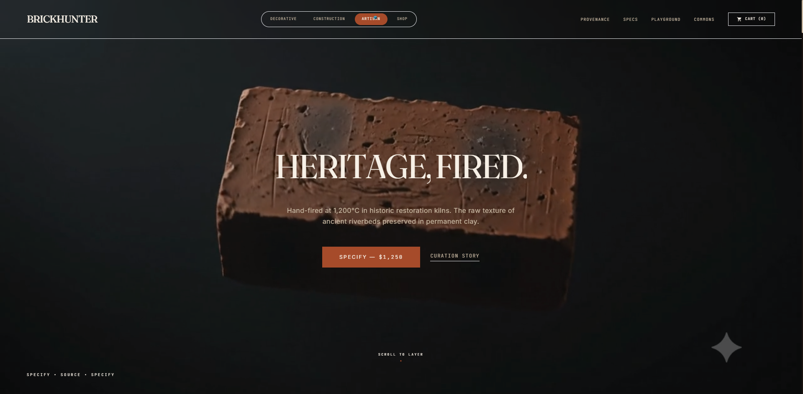
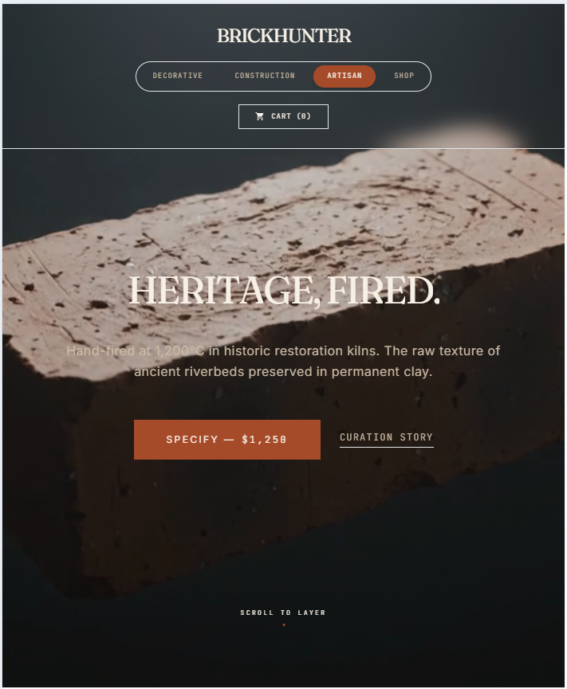
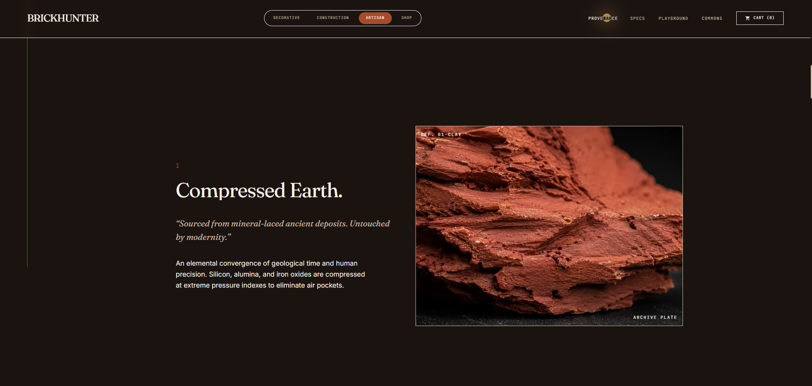
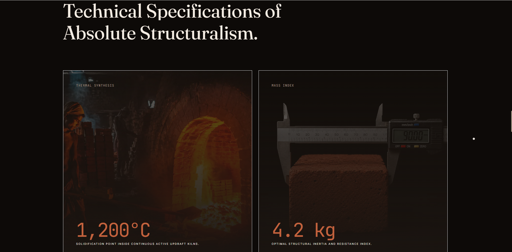
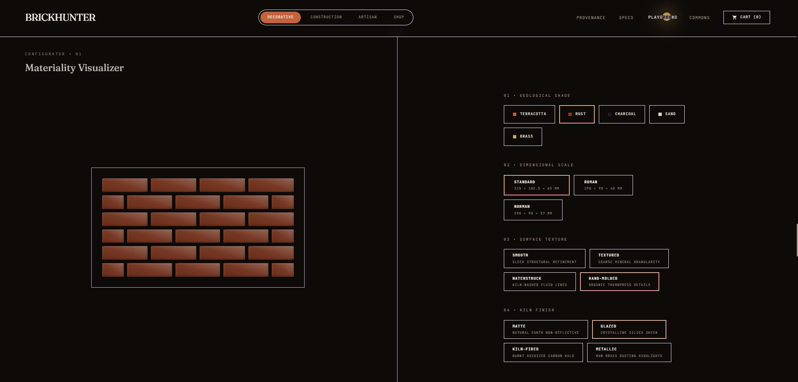
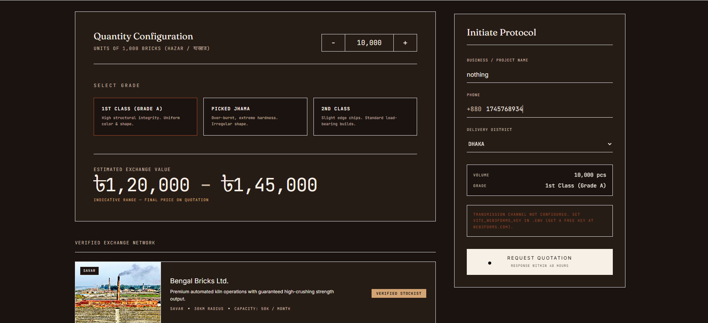
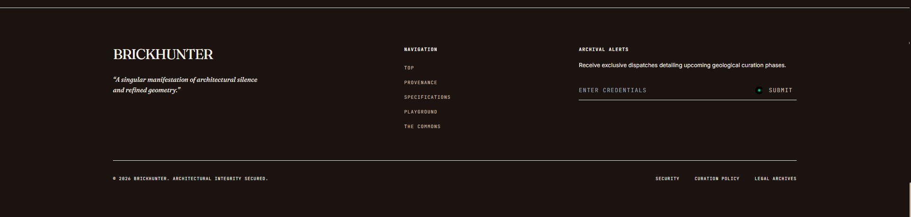

# The Monolith 🧱

> *It's not a brick. It's a lifestyle.*

An ultra-premium, one-of-one digital storefront for a single red brick — because if luxury fashion can sell you a $2,000 flip-flop, we can sell you $1,250 of "thermally-cured earthen silicate."

<p align="center">
  <a href="https://github.com/Siddik73/luxury-brick-storefront/actions/workflows/ci.yml">
    
  </a>
  
  
  
</p>

<p align="center">
  
</p>

<p align="center">
  <a href="https://luxury-brick-storefront.vercel.app/"><strong>🔗 View Live Demo »</strong></a>
</p>

---

## Table of Contents

- [About the Project](#about-the-project)
- [Built With](#built-with)
- [Features](#features)
- [Screenshots](#screenshots)
- [Architecture](#architecture)
- [Getting Started](#getting-started)
  - [Prerequisites](#prerequisites)
  - [Installation](#installation)
  - [Development Server](#development-server)
  - [Production Build](#production-build)
- [Usage](#usage)
- [Roadmap](#roadmap)
- [Contributing](#contributing)
- [License](#license)
- [Authors / Acknowledgments](#authors--acknowledgments)
- [Support / Contact](#support--contact)

---

## About the Project

The Monolith is a satirical exercise in luxury marketing psychology, disguised as a fully functional e-commerce storefront. The premise is simple and absurd: take the single most mundane, unglamorous object imaginable — a plain red clay brick — and sell it for $1,250 using the exact visual language, pacing, and pretension of a high-fashion editorial site.

Every design decision is deliberate theater. The void-black backgrounds and surgical negative space borrow from luxury beauty campaigns. The Playfair Display headlines and JetBrains Mono price tags borrow from watch auction houses. The scroll-triggered "Provenance" story — "Compressed Earth," "Calcined Fire," "Timeless Structure" — reads like tasting notes for a whisky that costs more than a used car. None of it is ironic in tone; it's played completely straight, which is exactly what makes it funny.

Underneath the joke is a genuinely serious technical build: a buttery-smooth GSAP ScrollSmoother experience, an interactive Spline 3D scene of the brick itself, a magnetic custom cursor, and — because why stop at absurd — a working Matter.js physics playground where you can pick up and throw the brick you just paid four figures for. It's proof that "vibe coding" with AI tools can produce something polished enough to be mistaken for a real product, even when the product is a load-bearing masonry unit.

This repository exists both as a portfolio piece and as a demonstration of an AI-assisted development pipeline — Idea → PRD → Design Doc → `todo.md` → AI Build → Human Review — executed end-to-end with Claude Code, GSAP, and Spline.

## Built With

<p align="left">
  
  
  
  
  
  
  
</p>

## Features

- 🖤 **Brutalist Luxury design system** — Void Black, Ember Red, Bone White, and Muted Gold, enforced through semantic Tailwind tokens
- 🧊 **Interactive 3D Hero** — a Spline-embedded brick you can click, drag, and spin, lazy-loaded with a graceful fallback
- 🪄 **Magnetic custom cursor** — an 8px cursor that snaps toward interactive elements and glows gold on hover, desktop-only
- 🌊 **GSAP ScrollSmoother** — buttery-smooth, momentum-based scrolling with automatic touch-device fallback to native scroll
- ✨ **Scroll-triggered text reveals** — every heading splits into words and animates in on entry, staggered for cinematic pacing
- 🧱 **Working physics playground** — a Matter.js sandbox where you can drag, drop, and collide bricks, complete with thud and rustle sound effects via the Web Audio API
- 📱 **Mobile-first touch optimization** — 44px minimum tap targets, `touch-action: manipulation`, and automatic 3D-to-static-image fallback on coarse pointers
- ♿ **Reduced-motion support** — every animation respects `prefers-reduced-motion`
- 🚀 **Performance-conscious** — route-level code splitting via `React.lazy()` for both the Spline scene and the physics playground

## Screenshots

| Hero (Desktop) | Hero (Mobile) |
| :---: | :---: |
|  |  |
| *The interactive 3D brick, front and center* | *Static fallback image on touch devices* |

| Provenance | Specs |
| :---: | :---: |
|  |  |
| *"Compressed Earth. Calcined Fire. Timeless Structure."* | *A brutalist bento grid of numbers as art* |

| Playground | Checkout |
| :---: | :---: |
|  |  |
| *Drag, drop, and collide bricks with real physics* | *An absurdly expensive, cryptographically-verified checkout* |

| Footer |
| :---: |
|  |
| *A quiet, museum-grade sign-off* |

> Screenshot files are placeholders — replace the images in `docs/SCREENSHOTS/` with real captures before publishing.

## Architecture

For a full breakdown of component structure, state flow, and third-party integrations (GSAP, Spline, Matter.js), see **[docs/ARCHITECTURE.md](docs/ARCHITECTURE.md)**.

## Getting Started

### Prerequisites

- **Node.js** 20 or later
- **npm** 10 or later

```bash
node --version
npm --version
```

### Installation

```bash
git clone https://github.com/Siddik73/luxury-brick-storefront.git
cd luxury-brick-storefront
npm install
```

### Development Server

```bash
npm run dev
```

The app will be available at `http://localhost:5173`.

### Production Build

```bash
npm run build
```

`npm run build` type-checks the project with `tsc` before bundling with Vite; the optimized output is written to `dist/`.

## Usage

Once running, scroll through the experience top to bottom:

1. **Hero** — drag and spin the 3D brick, or admire the static fallback on mobile
2. **Provenance** — scroll through the three-part origin story
3. **Specs** — a bento grid of technical specifications, "numbers as art"
4. **Playground** — click and drag bricks around a live physics sandbox; hit **Reset View** to respawn
5. **Checkout** — attempt to acquire your own Monolith for $1,250 (no actual payment processing is wired up — this is a portfolio piece)

```bash
# Everything is client-side; there is no backend to configure.
npm run dev
```

## Roadmap

- [ ] Wire up real Spline scene export (currently using a placeholder scene URL)
- [ ] Convert static image assets to WebP for smaller payloads
- [ ] Add a "Certificate of Ownership" post-purchase flow
- [ ] Extract inline physics/touch-detection logic into dedicated hooks (`useIsTouch`, `usePhysics`)
- [ ] Wire CI to auto-deploy on push (currently build-verification only)
- [ ] Add automated visual regression tests for the animation-heavy sections

See the [open issues](https://github.com/Siddik73/luxury-brick-storefront/issues) for a full list of proposed features and known issues.

## Contributing

Contributions are what make the open-source community such an amazing place to learn and create. Any contributions you make are **greatly appreciated**.

Please read **[CONTRIBUTING.md](CONTRIBUTING.md)** for details on our code of conduct and the process for submitting pull requests.

## License

Distributed under the MIT License. See **[LICENSE](LICENSE)** for more information.

## Authors / Acknowledgments

- **Siddik73** — *Creator & Developer*
- Built with [Claude Code](https://claude.com/claude-code) as an AI pair-programmer
- Design system exported from [Google Stitch](https://stitch.withgoogle.com/)
- 3D scenes powered by [Spline](https://spline.design/)
- Animation by [GSAP](https://gsap.com/)

## Support / Contact

Found a bug, or just want to say the brick is beautiful? [Open an issue](https://github.com/Siddik73/luxury-brick-storefront/issues/new/choose) or reach out directly.

<p align="center"><em>The Monolith. Unyielding. Elemental. Absolute.</em></p>
